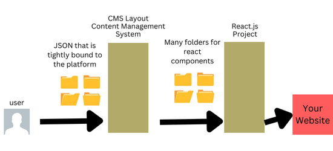
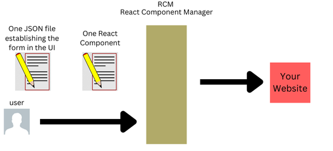
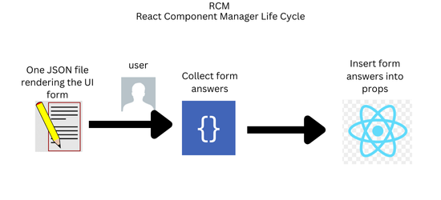

# What is an RCM?

## RCM compared to a CMS

### What is a CMS?

A **Content Management System (CMS)** typically operates with a separate layer for JSON data and another separate layer for the React component. This separation means that the JSON data is used to populate the React component, but the component's structure remains relatively fixed. It takes two systems using react to create a website.

### The RCM advantage

The **React Component Manager** will use only one JSON file and one React component. Your tech debt for your website is as small as it can get. The RCM is built for business includes real-time collaboration, user roles, and navigation. This allows for the website to be reusable. Instead of rebuilding a new website, you can change the components and order of the components and pages of the components.

## RCM life cycle

1) A form is generated from the JSON file.  
2) The user enters the data into the form.  
3) The answers from the user are used as props in the React component.  

<!-- 
### What is a RCM
An **RCM (React Component Management)** system, on the other hand, works differently. In an RCM, a JSON file not only populates the component but also changes the props of the React component dynamically. This effectively turns the React component into a "madlib" (a word game where you fill in the blanks). The component's behavior and presentation can change entirely based on the JSON input, allowing for a more flexible and dynamic system. 

test

-->
